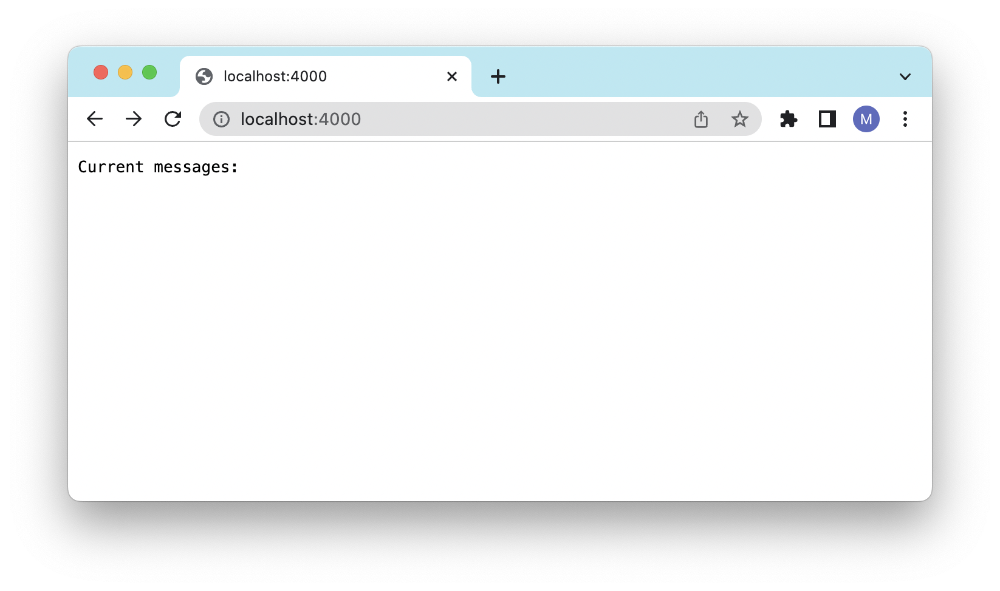

# Lab Report 2 
[Miranda Zhou](https://github.com/Miranda-Y-Zhou)

Date: 10/22/2023

Back to [index](https://miranda-y-zhou.github.io/cse15l-lab-reports/)

---

## Servers and SSH Keys (Week 3)

The objective of this lab is to create a Java web server, `StringServer`, to accumulate and display messages.
This lab also delve into SSH key authentication, showcasing a password-less login to `ieng6`, followed by reflections on the learnings from weeks 2 and 3.


* [Web Server: `StringServer`](https://miranda-y-zhou.github.io/cse15l-lab-reports/lab_report2.html#string-server)
* [SSH Key](https://miranda-y-zhou.github.io/cse15l-lab-reports/lab_report2.html#ssh-key)
* [Learning Reflection](https://miranda-y-zhou.github.io/cse15l-lab-reports/lab_report2.html#learning-reflection)

---

### String Server

The `StringServer` is a Java web server designed to maintain a running string of messages. Users can add messages via incoming requests, and each message gets prefixed with a sequential number. When accessed without a specific query in the URL, the server displays the accumulated list of messages to the user.

```
import java.io.IOException;
import java.net.URI;

class Handler implements URLHandler {
    // The one bit of state on the server: a number that will be manipulated by
    // various requests.

    // num is the current number of messages in the server
    int num = 0;
    String allMessages = "";

    public String handleRequest(URI url) {
        if (url.getPath().equals("/")) {
            return "Current messages:" + '\n' + allMessages;
        } 
        else {
            if (url.getPath().contains("/add-message")) {
                String[] parameters = url.getQuery().split("=");
                if (parameters[0].equals("s")) {
                    num += 1;
                    allMessages = allMessages + String.format("\n %d. %s", num, parameters[1]);
                    return String.format("The message '%s' is successfully added!", parameters[1]);
                }
                else {
                return "ERROR: '/add-message' requires a valid query that begins with '?s=<string>'" + 
                        "\n Example: '/add-message?s=Hello'" + 
                        "\n The page would show: '1. Hello'";
                }
            }
            return "404 Not Found!";
        }
    }
}

class StringServer {
    public static void main(String[] args) throws IOException {
        if(args.length == 0){
            System.out.println("Missing port number! Try any number between 1024 to 49151");
            return;
        }

        int port = Integer.parseInt(args[0]);

        Server.start(port, new Handler());
    }
}
```

The server page should look like this in a web browser:



&nbsp;

#### Example 1: 

The user adds the string message: `Daisy`


Resulting string of messages:


&nbsp;

#### Example 2: 

The user adds the string message: `Roses are red` 


It is noted that spaces in the query appears as `%20`.

Resulting string of messages:


&nbsp;

#### Example 3: 

When the user tries to add a string message, but without following the correct query syntax:


This is because the server `StringServer` has been programmed to expect a specific query structure for adding messages. If the incoming request doesn't adhere to this expected format, the server is designed to recognize the discrepancy and respond with an error message to inform the user of the incorrect input. This ensures that users adhere to the expected input pattern and that the server remains resilient against unintended or malicious inputs.

&nbsp;

---

### SSH Key Authentication

SSH key authentication is a secure method for remote server access, utilizing a pair of cryptographic keys: a private key kept by the user and a public key stored on the server. Instead of using passwords, the server confirms the identity of the user by challenging them to prove ownership of the private key. This method enhances security and facilitates password-less logins.

#### 1. Locating the private key on local computer:

As shown in the image above, the path to the private key for logging into `ieng6` is `/home` on the user's local computer.

&nbsp;

#### 2. Locating the public key on `ieng6`:

As shown in the image above, the path to the public key for logging into `ieng6` is `/user/ ` on the remote computer `ieng6`.

&nbsp;

#### 3. Logging into `ieng6` without password:

As shown in the image above, the user can now access the remote computer `ieng6` both swiftly and securely.

&nbsp;

---

### Learning Reflection


&nbsp;

