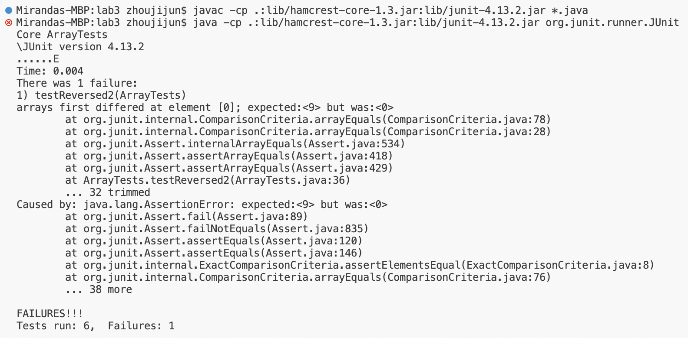
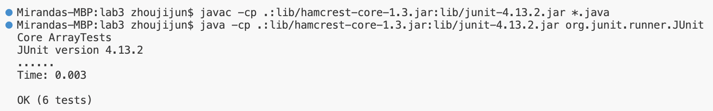

# Lab Report 3
[Miranda Zhou](https://github.com/Miranda-Y-Zhou)

Date: 11/05/2023

Back to [index](https://miranda-y-zhou.github.io/cse15l-lab-reports/)

---

## Bugs and Commands (Week 5)

The objective of this lab is to further analyze and document a bug from week 4's lab, illustrating it with JUnit test cases.
This lab also explore the functionalities of the terminal command `grep` by providing examples of its command-line options.


* [Bugs from Week 4's Lab](https://miranda-y-zhou.github.io/cse15l-lab-reports/lab_report3.html#bugs-from-week-4s-lab)
* [Terminal Command: `grep`](https://miranda-y-zhou.github.io/cse15l-lab-reports/lab_report3.html#terminal-command-grep)
* [References](https://miranda-y-zhou.github.io/cse15l-lab-reports/lab_report3.html#references)

---

### Bugs from Week 4's Lab

The original `reversed` method from `ArrayExamples` class is shown below. 
```
static int[] reversed(int[] arr) {
    int[] newArray = new int[arr.length];
    for(int i = 0; i < arr.length; i += 1) {
      arr[i] = newArray[arr.length - i - 1];
    }
    return arr;
  }
```
This method is designed to take in an integer array and return a **new** array with all the elements of the input array in reversed order.

Initially, attention is given to a test case that is expected to fail, revealing the flaw in the `reversed` method. The JUnit test below has been designed to reverse a non-empty array and, as such, should demonstrate the defect in the method's implementation.

```
@Test
  public void testReversed2() {
    int[] input1 = { 1, 5, 6, 3, 9 };
    assertArrayEquals(new int[]{ 9, 3, 6, 5, 1 }, ArrayExamples.reversed(input1));
  }
```

Failure-inducing input: `{ 1, 5, 6, 3, 9 }`

There's a situation where the method in question works just fine. If the user hand it an empty array, it outputs back an empty array, which is exactly expected output. The following test case confirms this observation.

```
@Test
  public void testReversed() {
    int[] input1 = {};
    assertArrayEquals(new int[]{}, ArrayExamples.reversed(input1));
  }
```

Input that doesn’t induce a failure: `{}`

Upon execution of the JUnit tests, it is observed that the `testReversed2` fails, its symptom shown in the image below. The `testReversed` test, however, succeeds, which suggests that the method is capable of handling empty arrays without introducing errors.



**The Bug in Code**

Here's the original method that contains the bug. It attempts to assign the new integer array list's elements into the old one, which is not the intended behavior. 

```
static int[] reversed(int[] arr) {
    int[] newArray = new int[arr.length];
    for(int i = 0; i < arr.length; i += 1) {
      arr[i] = newArray[arr.length - i - 1];
    }
    return arr;
  }
```

**The Corrected Method**

After identifying the issue, the method was corrected to ensure that a new array is assigned with the reversed elements of the original array, which remains unchanged:

```
static int[] reversed(int[] arr) {
    int[] newArray = new int[arr.length];
    for(int i = 0; i < arr.length; i += 1) {
      newArray[arr.length - i - 1] = arr[i]; 
    }
    return newArray;
  }
```

**Explaining the Fix**

The original code failed because it attempts to assign elements of the new integer array into the input array, which is the opposite assignment of what it is intended. Since the new array is created to be an empty array of the same length as the original, it is just an array with filled with `0`. Thus, this original method simply assigns `0` to all elements of the input array. The corrected code resolves the problem by correctly assigning the elements from the end of the input integer array to the beginning of the new array newArray. The loop now iterates through each index and assigns the corresponding reversed value properly to the new integer array. This fix ensures that the reversed method behaves as intended, returning a new array with elements in reverse order, without modifying the original array.

With these changes, the reversed method now accurately produces a new array with the input array's elements reversed, and the passing of all JUnit test cases confirm this expected behavior.



&nbsp;

---

### Terminal Command: `grep` 

The `grep` command is a powerful tool for searching through text and files for lines that match a given string, then printing matching lines. Here are four interesting options for `grep` and two examples for each, applied to files and directories from `./technical`.

#### 1. Case-Insensitive Search `-i`

&nbsp;

#### 2. Line Number `-n`

&nbsp;

#### 3. Recursive Search `-r`

&nbsp;

#### 4. Count Matches `-c`


&nbsp;

---

### References

&nbsp;
