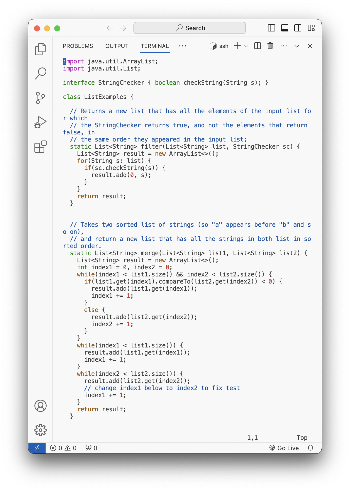

# Lab Report 4
[Miranda Zhou](https://github.com/Miranda-Y-Zhou)

Date: 11/19/2023

Back to [index](https://miranda-y-zhou.github.io/cse15l-lab-reports/)

---

## Vim (Week 7)

The objective of this lab is to thoroughly document the steps (4-9) undertaken in Week 7's lab activity, which involves correcting a Java code bug from Week 3's lab, solely from the command-line. 

* [Step 4: Log into ieng6](https://miranda-y-zhou.github.io/cse15l-lab-reports/lab_report4.html#step-4-log-into-ieng6)
* [Step 5: Clone your fork of the repository](https://miranda-y-zhou.github.io/cse15l-lab-reports/lab_report4.html#step-5-clone-your-fork-of-the-repository-from-your-github-account-using-the-ssh-url)
* [Step 6: Run the tests (fail)](https://miranda-y-zhou.github.io/cse15l-lab-reports/lab_report4.html#step-6-run-the-tests-demonstrating-that-they-fail)
* [Step 7: Edit the code file to fix the failing test](https://miranda-y-zhou.github.io/cse15l-lab-reports/lab_report4.html#step-7-edit-the-code-file-to-fix-the-failing-test)
* [Step 8: Run the tests (succeed)](https://miranda-y-zhou.github.io/cse15l-lab-reports/lab_report4.html#step-8-run-the-tests-demonstrating-that-they-now-succeed)
* [Step 9: Commit and push to Github](https://miranda-y-zhou.github.io/cse15l-lab-reports/lab_report4.html#step-9-commit-and-push-the-resulting-change-to-your-github-account)

**The Original Bugged Java Code `ListExamples.java`**

```
import java.util.ArrayList;
import java.util.List;

interface StringChecker { boolean checkString(String s); }

class ListExamples {

  // Returns a new list that has all the elements of the input list for which
  // the StringChecker returns true, and not the elements that return false, in
  // the same order they appeared in the input list;
  static List<String> filter(List<String> list, StringChecker sc) {
    List<String> result = new ArrayList<>();
    for(String s: list) {
      if(sc.checkString(s)) {
        result.add(0, s);
      }
    }
    return result;
  }

  // Takes two sorted list of strings (so "a" appears before "b" and so on),
  // and return a new list that has all the strings in both list in sorted order.
  static List<String> merge(List<String> list1, List<String> list2) {
    List<String> result = new ArrayList<>();
    int index1 = 0, index2 = 0;
    while(index1 < list1.size() && index2 < list2.size()) {
      if(list1.get(index1).compareTo(list2.get(index2)) < 0) {
        result.add(list1.get(index1));
        index1 += 1;
      }
      else {
        result.add(list2.get(index2));
        index2 += 1;
      }
    }
    while(index1 < list1.size()) {
      result.add(list1.get(index1));
      index1 += 1;
    }
    while(index2 < list2.size()) {
      result.add(list2.get(index2));
      // change index1 below to index2 to fix test
      index1 += 1;
    }
    return result;
  }
}
```

It is identified previously that in order to fix the bug, `index1` need to be changed to `index2` in `ListExamples.java`.

&nbsp;

---

### Step 4: Log into ieng6


Keys Pressed:

`ssh` + `<space>` + `cs15lfa23do@ieng6-201.ucsd.edu` + `<enter>`
* to log into remote computer `ieng6-201` using the command `ssh` and the user name `cs15lfa23do`
* no password required because ssh key was set up in local computer

&nbsp;

---

### Step 5: Clone your fork of the repository from your Github account (using the SSH URL)


Key Pressed:

`git clone` + `<space>` + `<control>` + `p` + `<enter>`
* to clone the repository of the following ssh url (`git@github.com:Miranda-Y-Zhou/lab7.git`) copied from github.

&nbsp;

---

### Step 6: Run the tests, demonstrating that they fail


Key Pressed:

`cd` + `<space>` + `lab7/` + `<enter>`
* to change the working directory to the directory just cloned

`bash` + `<space>` + `test.sh` + `<enter>`
* to run the shell script `test.sh` which include the terminal commands that compile all java files and run `ListExamplesTests.class`:
  * `javac -cp .:lib/hamcrest-core-1.3.jar:lib/junit-4.13.2.jar *.java`
  * `java -cp .:lib/hamcrest-core-1.3.jar:lib/junit-4.13.2.jar org.junit.runner.JUnitCore ListExamplesTests`


&nbsp;

---

### Step 7: Edit the code file to fix the failing test



`vim` + `ListExamples.java` + `<enter>`
* to open `ListExamples.java` in Vim text editor in terminal, as shown in image above


`<esc>` + `:44` + `e`
* `<esc>` to make sure in `Normal mode`
* `:44` to jump to line 44, where the error is identified
* `e` to jump to the end of word, which is the character `1` that we want to replace with `2`


`r2` + `<esc>` + `:wq` + `<enter>`
* `r2` to replace `1` with `2`
  * pressing the `r` will delete the character `1` under crusor and enter `Insert mode`
  * pressing the `2` will insert `2` at the place of crusor
* `<esc>` to switch back to `Normal mode`
* `:wq` to save file and quit Vim text editor

&nbsp;

---

### Step 8: Run the tests, demonstrating that they now succeed


`bash` + `<space>` + `test.sh` + `<enter>`
* to run the shell script `test.sh` which include the terminal commands that compile all java files and run `ListExamplesTests.class`:
  * `javac -cp .:lib/hamcrest-core-1.3.jar:lib/junit-4.13.2.jar *.java`
  * `java -cp .:lib/hamcrest-core-1.3.jar:lib/junit-4.13.2.jar org.junit.runner.JUnitCore ListExamplesTests`

&nbsp;

---

### Step 9: Commit and push the resulting change to your Github account


`git` + `<space>` + `add` + `<space>` + `ListExamples.java` + `<enter>`

* to "stage" `ListExamples.java` to be part of the next commit

`git` + `<space>` + `commit` + `<space>` + `-m` + `<space>` + `"Updated ListExamples.java"` + `<enter>`

* `git commit` to commite the file added locally
* `-m` option allows the user to add a commit message, `"Updated ListExamples.java"`, directly from the command line

`git push` + `<enter>`

* to copy all new commits to remote (github)

&nbsp;

---
