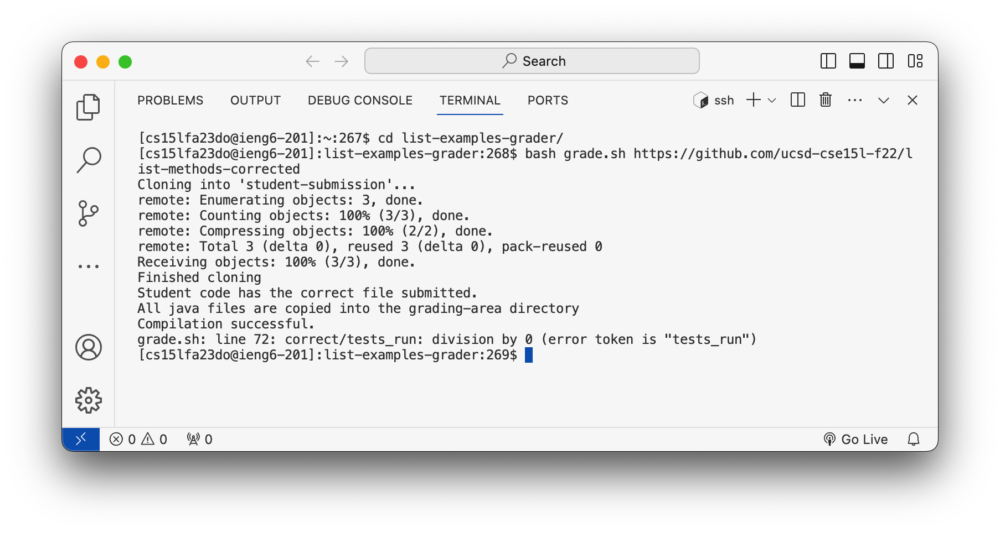
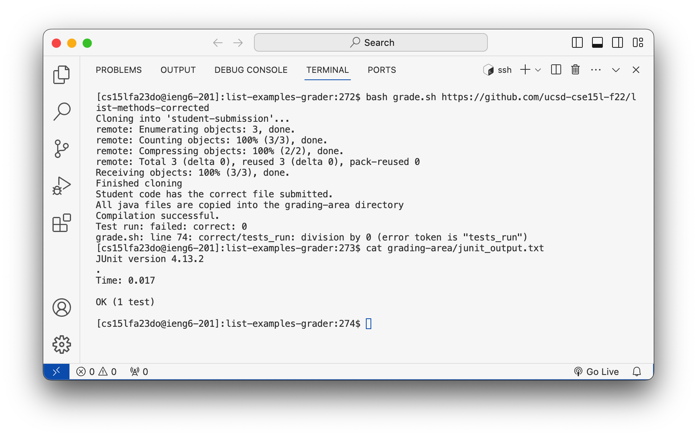
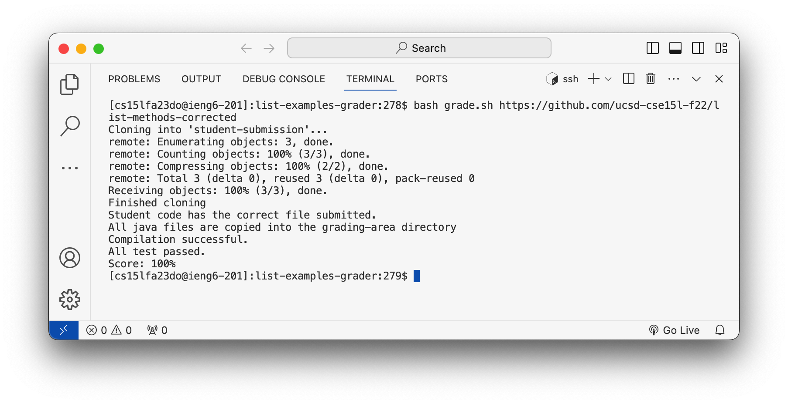

# Lab Report 5
[Miranda Zhou](https://github.com/Miranda-Y-Zhou)

Date: 12/03/2023

Back to [index](https://miranda-y-zhou.github.io/cse15l-lab-reports/)

---

## Putting it All Together (Week 9)

The objective of this lab is to simulate a debugging process for a Java program and bash script, followed by reflections on the learnings from the second half of this quarter.

* [Debugging Scenario](https://miranda-y-zhou.github.io/cse15l-lab-reports/lab_report5.html#debugging-scenario)
* [Learning Reflection](https://miranda-y-zhou.github.io/cse15l-lab-reports/lab_report5.html#learning-reflection)

---

### Debugging Scenario

#### Original File

**Directory and File Structure**

The directory and file structure is designed to facilitate the testing and grading of student submitted Java program:

* `list-examples-grader`
  * `lib`
    * `hamcrest-core-1.3.jar`
    * `junit-4.13.2.jar`
  * `grade.sh`
  * `GradeServer.java`
  * `Server.java`
  * `TestListExamples.java`

The main components are as follows:

`ListExamples.java`: This is the student submitted Java file. It defines a class ListExamples with methods filter and merge. The filter method filters a list of strings based on a given condition, and the merge method merges two sorted lists into a single sorted list.

`TestListExample.java`: This file contains JUnit tests for the `ListExamples` class to verify the correctness of the merge method in ListExamples.

`grade.sh`: This bash script is used for automating the grading process. It performs various tasks such as cloning the student's submission from a repository, verifying the presence of the required Java files, compiling the Java files, running JUnit tests, and calculating the score based on test outcomes.

It is noted that two more directories, `student-submission` and `grading-area` will be created under `list-examples-grader` by the `grade.sh` once it is ran. 

**Java File**

`ListExamples.java` has the contents below:

```
import java.util.ArrayList;
import java.util.List;

interface StringChecker { boolean checkString(String s); }

class ListExamples {

  // Returns a new list that has all the elements of the input list for which
  // the StringChecker returns true, and not the elements that return false, in
  // the same order they appeared in the input list;
  static List<String> filter(List<String> list, StringChecker sc) {
    List<String> result = new ArrayList<>();
    for(String s: list) {
      if(sc.checkString(s)) {
        result.add(s);
      }
    }
    return result;
  }


  // Takes two sorted list of strings (so "a" appears before "b" and so on),
  // and return a new list that has all the strings in both list in sorted order.
  static List<String> merge(List<String> list1, List<String> list2) {
    List<String> result = new ArrayList<>();
    int index1 = 0, index2 = 0;
    while(index1 < list1.size() && index2 < list2.size()) {
      if(list1.get(index1).compareTo(list2.get(index2)) < 0) {
        result.add(list1.get(index1));
        index1 += 1;
      }
      else {
        result.add(list2.get(index2));
        index2 += 1;
      }
    }
    while(index1 < list1.size()) {
      result.add(list1.get(index1));
      index1 += 1;
    }
    while(index2 < list2.size()) {
      result.add(list2.get(index2));
      index2 += 1;
    }
    return result;
  }


}

```

`TestListExample.java` has the contents below:

```
import static org.junit.Assert.*;
import org.junit.*;
import java.util.Arrays;
import java.util.List;

class IsMoon implements StringChecker {
  public boolean checkString(String s) {
    return s.equalsIgnoreCase("moon");
  }
}

public class TestListExamples {
  @Test(timeout = 500)
  public void testMergeRightEnd() {
    List<String> left = Arrays.asList("a", "b", "c");
    List<String> right = Arrays.asList("a", "d");
    List<String> merged = ListExamples.merge(left, right);
    List<String> expected = Arrays.asList("a", "a", "b", "c", "d");
    assertEquals(expected, merged);
  }
}

```

**Bash Script**

`grade.sh` has the contents below:

```
CPATH='.:../lib/hamcrest-core-1.3.jar:../lib/junit-4.13.2.jar'

# clean up any previous student submissions and grading areas
rm -rf student-submission
rm -rf grading-area

# Create a new grading area
mkdir grading-area

# Git clone the student repository 
git clone $1 student-submission
echo 'Finished cloning'

# Define variables for file path
DIR_NAME="student-submission"
FILE_NAME="ListExamples.java"
FILE_PATH="student-submission/ListExamples.java"

# Check if the expected file exists
if [ ! -f "student-submission/ListExamples.java" ]; then
    # Provide feedback and exit if the file does not exist
    echo "Error: Expected file '$FILE_NAME' not found in the submission."
    exit 1
fi

echo "Student code has the correct file submitted."

# Copy relevent files for grading into grading-area
cp "student-submission/ListExamples.java" "grading-area"
cp "TestListExamples.java" "grading-area"
cp "GradeServer.java" "grading-area"
cp "Server.java" "grading-area"

echo "All java files are copied into the grading-area directory"

# Change working directory into grading area
cd grading-area

# Complie all the java files
javac -cp $CPATH *.java &> "javac_output.txt"

# Check the exit status of the last command (javac)
if [ $? -ne 0 ]; then
    echo "Compilation failed:"
    grep "error" javac_output.txt
    exit 1
else
    echo "Compilation successful."
fi

# Run JUnit Tests
java -cp $CPATH org.junit.runner.JUnitCore TestListExamples &> "junit_output.txt"

tests_run=$(grep -o 'run: [0-9]*' junit_output.txt | grep -o '[0-9]*')
failures=$(grep -o 'Failures: [0-9]*' junit_output.txt | grep -o '[0-9]*')
correct=$((tests_run-failures))

# Calculate grade
echo "Score:" $((correct/tests_run))"%"

# Back to original directory
cd ..

```

&nbsp;

#### Student's EdStem Post

After running `grade.sh` using [this student submission repository](https://github.com/ucsd-cse15l-f22/list-methods-corrected) to test the bash script, the student got a different output than expected. The student makes a post on EdStem about this symptom.

> Hello, I've encountered a bug while running the grade.sh script and I'm not sure what's causing it. I used the following command to test the script: `bash grade.sh https://github.com/ucsd-cse15l-f22/list-methods-corrected`. This command should execute the script using [this student submission repository](https://github.com/ucsd-cse15l-f22/list-methods-corrected) provided. After the script shows `Compilation successful.`, it's expected to output the score as `Score: 100%`. However, I'm getting an error at this stage: `grade.sh: line 72: correct/tests_run: division by 0 (error token is "tests_run")` This error suggests that the variable tests_run is zero at the point of calculating the score, leading to a division by zero. This is confusing because, regardless of whether the JUnit tests pass or fail, there should be at least one test run, as indicated by the script's logic. So, I'm puzzled as to why the tests_run variable would be zero. I've attached the terminal out put and github repository containing my code.

[https://github.com/Miranda-Y-Zhou/list-examples-grader.git](https://github.com/Miranda-Y-Zhou/list-examples-grader.git)



&nbsp;

#### TA's EdStem Posts

> Hi, thanks for reaching out with your issue. From what you've described, it seems like the script is not correctly capturing the number of tests run, resulting in the division by zero error. This can happen if the expected output format from JUnit does not match what the script is parsing. A good starting point would be to inspect the contents of the `junit_output.txt` file. This file should contain the details of the JUnit test execution, including the number of tests run and the number of failures. Perhaps you could try to add echo statements in your script to check your variables, and to run the command `cat grading-area/junit_output.txt`. This command will display the contents of the `junit_output.txt` file, which will help you understand if the script is correctly parsing the number of tests run (`tests_run`) and the number of failures (`failures`).

&nbsp;

#### Trying Out TA's Suggestions

The student went on adding a few echo statements to `grade.sh` to print out `tests_run`, `failures`, and `correct`. 
The student also viewed the contents of `junit_output.txt` file usinig `cat` command as suggested by the TA.



It's noted that the variables `tests_run` and `failures` were empty, therefore resulting in the division by zero error.
Upon further inspection of the `junit_output.txt` file, it's found that when all JUnit tests succeed, the output is simply `OK (1 test)` and does not explicitly state the number of tests run and failed, unlike when there are failing tests. This difference in output format when no tests fail is likely why the script isn't capturing the number of tests correctly, since the `grep` command cannot find the correct patterns therefore cannot assign the variables.

#### Fixed Code

To resolve the bug, the student introduced an `if` statement to `grade.sh` to handle scenarios where no JUnit tests failed. This addition ensures that the `grep` commands for extracting the number of tests and errors are bypassed when all tests pass. In such cases, the script automatically assigns a score of `100%`, effectively addressing the issue of handling different output formats for successful test runs.

The fixed `grade.sh`:

```
CPATH='.:../lib/hamcrest-core-1.3.jar:../lib/junit-4.13.2.jar'

# clean up any previous student submissions and grading areas
rm -rf student-submission
rm -rf grading-area

# Create a new grading area
mkdir grading-area

# Git clone the student repository 
git clone $1 student-submission
echo 'Finished cloning'

# Define variables for file path
DIR_NAME="student-submission"
FILE_NAME="ListExamples.java"
FILE_PATH="student-submission/ListExamples.java"

# Check if the expected file exists
if [ ! -f "student-submission/ListExamples.java" ]; then
    # Provide feedback and exit if the file does not exist
    echo "Error: Expected file '$FILE_NAME' not found in the submission."
    exit 1
fi

echo "Student code has the correct file submitted."

# Copy relevent files for grading into grading-area
cp "student-submission/ListExamples.java" "grading-area"
cp "TestListExamples.java" "grading-area"
cp "GradeServer.java" "grading-area"
cp "Server.java" "grading-area"

echo "All java files are copied into the grading-area directory"

# Change working directory into grading area
cd grading-area

# Complie all the java files
javac -cp $CPATH *.java &> "javac_output.txt"

# Check the exit status of the last command (javac)
if [ $? -ne 0 ]; then
    echo "Compilation failed:"
    grep "error" javac_output.txt
    exit 1
else
    echo "Compilation successful."
fi

# Run JUnit Tests
java -cp $CPATH org.junit.runner.JUnitCore TestListExamples &> "junit_output.txt"

# Calculate grade
if [ $? -eq 0 ]; then
    echo "All test passed."
    echo "Score: 100%"
    exit 0
fi

tests_run=$(grep -o 'run: [0-9]*' junit_output.txt | grep -o '[0-9]*')
failures=$(grep -o 'Failures: [0-9]*' junit_output.txt | grep -o '[0-9]*')
correct=$((tests_run-failures))

echo "Test run:" $tests_run "failed:" $failures "correct:" $correct
echo "Score:" $((correct/tests_run))"%"

# Back to original directory
cd ..

```

The terminal output from running `bash grade.sh https://github.com/ucsd-cse15l-f22/list-methods-corrected` is now as desired:



&nbsp;

---

### Learning Reflection


&nbsp;
